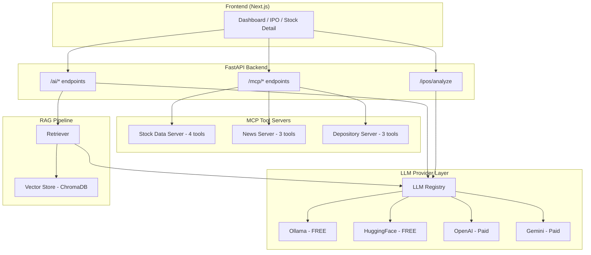

# FinPilot — MCP & LLM Implementation Guide

How the AI stack (MCP servers, LLM providers, RAG pipeline) is implemented, where each component lives, and the user journey through these features.

---

## Architecture Overview



---

## 1. LLM Provider System

### Where It Lives
```
backend/app/services/llm/
├── llm_base.py             # Abstract base class
├── llm_registry.py         # Provider management
├── ollama_provider.py      # FREE — local Ollama
├── huggingface_provider.py # FREE — cloud HuggingFace
```

### How It Works

**LLMBase** defines the contract every provider must implement:
```python
class LLMBase(ABC):
    async def chat(prompt, system_prompt, temperature) -> LLMResponse
    async def analyze_stock(symbol, data) -> LLMResponse  # Built-in prompt
    async def summarize_news(articles) -> LLMResponse      # Built-in prompt
```

**LLM Registry** manages providers:
```python
from app.services.llm.llm_registry import get_provider, list_providers, set_active_provider

# Get the active provider (default: Ollama)
provider = get_provider()

# Or get a specific one
provider = get_provider("huggingface")

# Switch default
set_active_provider("ollama")
```

### Available Providers

| Provider | Cost | Requires | Config Key | Install |
|----------|------|----------|------------|---------|
| **Ollama** (default) | Free | Local Ollama running | `OLLAMA_BASE_URL`, `OLLAMA_MODEL` | `ollama pull llama3.2 && ollama serve` |
| **HuggingFace** | Free | None (rate-limited without key) | `HUGGINGFACE_API_KEY` | — |
| **OpenAI** | Paid | API key | `OPENAI_API_KEY` | — |
| **Gemini** | Free tier | API key | `GEMINI_API_KEY` | — |
| **Anthropic** | Paid | API key | `ANTHROPIC_API_KEY` | — |

### Config (backend/app/core/config.py)
```python
LLM_PROVIDER: str = "ollama"       # Default active provider
OLLAMA_BASE_URL: str = "http://localhost:11434"
OLLAMA_MODEL: str = "llama3.2"
OPENAI_API_KEY: str = ""           # Auto-enables if set
GEMINI_API_KEY: str = ""
ANTHROPIC_API_KEY: str = ""
HUGGINGFACE_API_KEY: str = ""
```

### API Endpoints

| Endpoint | Method | Purpose |
|----------|--------|---------|
| `/api/v1/ai/providers` | GET | List all available LLM providers |
| `/api/v1/ai/provider` | PUT | Switch active provider (`{"provider": "ollama"}`) |
| `/api/v1/ai/analyze-stock` | POST | AI-powered stock analysis |
| `/api/v1/ai/chat` | POST | General-purpose AI chat |
| `/api/v1/ai/summarize-news` | POST | Financial news summarization |

---

## 2. MCP (Model Context Protocol) Servers

### Where It Lives
```
backend/app/mcp/
├── stock_data_server.py    # 4 tools — real-time & historical stock data
├── news_server.py          # 3 tools — financial news via RSS
├── depository_server.py    # 3 tools — NSDL/CDSL, ISIN lookup

backend/app/api/api_v1/
└── mcp_router.py           # Unified API: GET /mcp/tools, POST /mcp/call
```

### How It Works

Each MCP server defines:
1. **Tool definitions** (JSON Schema) — what the tool does and what arguments it takes
2. **Tool handlers** — async Python functions that execute the tool
3. **handle_tool_call()** — dispatcher that routes tool name → handler

The **mcp_router.py** aggregates all servers into a unified API:

```python
# List all available tools across all servers
GET /api/v1/mcp/tools

# Execute any tool
POST /api/v1/mcp/call
{
    "tool_name": "get_stock_quote",
    "arguments": {"symbol": "RELIANCE"}
}
```

### Available MCP Tools

#### Stock Data Server (4 tools)
| Tool | Description | Data Source |
|------|-------------|-------------|
| `get_stock_quote` | Real-time quote (price, change, P/E, 52W range) | yfinance |
| `get_stock_history` | OHLCV price history (1d to 5y) | yfinance |
| `get_stock_financials` | Quarterly & annual financial statements | yfinance |
| `search_stocks` | Search stocks by name/keyword | Local DB |

#### News Server (3 tools)
| Tool | Description | Data Source |
|------|-------------|-------------|
| `get_financial_news` | Latest market news by category | RSS feeds (Economic Times, MoneyControl) |
| `get_stock_news` | News for a specific stock | RSS + keyword filter |
| `get_ipo_news` | Latest IPO-related news | RSS feeds |

#### Depository Server (3 tools)
| Tool | Description | Data Source |
|------|-------------|-------------|
| `parse_cas_statement` | Parse CAS PDF from file path | pdfplumber |
| `get_depository_info` | NSDL/CDSL integration instructions | Static |
| `get_isin_details` | ISIN → stock details lookup | Built-in database (15 stocks) |

### When MCP Tools Are Used

1. **AI Stock Analysis** — the LLM can call `get_stock_quote` and `get_stock_financials` to get live data before analyzing
2. **News Summarization** — `get_financial_news` feeds articles to the LLM for summarization
3. **IPO Research** — `get_ipo_news` provides latest IPO news for AI analysis
4. **Portfolio Sync** — `parse_cas_statement` extracts holdings from CAS PDFs

---

## 3. RAG Pipeline

### Where It Lives
```
backend/app/services/rag/
├── vectorstore.py     # ChromaDB vector store + keyword fallback
├── retriever.py       # Ingest → Retrieve → LLM Synthesize
```

### How It Works

```
1. INGEST                    2. RETRIEVE               3. SYNTHESIZE
Documents → Chunk →          User query →              Retrieved docs →
Embed → Store in ChromaDB    Vector search →            LLM prompt →
                              Top-K results              Analysis output
```

**Ingest functions:**
```python
from app.services.rag.retriever import ingest_earnings_call, ingest_balance_sheet, ingest_news

# Store earnings call data
ingest_earnings_call("RELIANCE", {
    "date": "2026-Q3",
    "summary": "...",
    "promises": ["increase refining capacity"],
    "delivery": "Delivered"
})

# Store balance sheet
ingest_balance_sheet("RELIANCE", quarterly=[...], yearly=[...])
```

**Retrieve and analyze:**
```python
result = await retrieve_and_analyze(
    symbol="RELIANCE",
    query="Is Reliance management delivering on promises?",
    provider_name="ollama"
)
# Returns: {analysis, sources_used, documents, provider}
```

### Vector Store Behavior
- **ChromaDB installed** → Uses cosine similarity search
- **ChromaDB NOT installed** → Falls back to keyword-based matching (works for development)

---

## 4. User Journey

### Journey 1: New User Registration → Dashboard

```
Register (/register)          Login (/login)           Dashboard (/)
┌─────────────────┐          ┌──────────────┐          ┌──────────────┐
│ Name             │  ──────▶ │ Email         │  ──────▶ │ Net Worth     │
│ Email            │          │ Password      │          │ Day Change    │
│ Phone (+91)      │          │ [Eye toggle]  │          │ Allocation    │
│ Password         │          └──────────────┘          │ Top Movers    │
│ Confirm Password │                                    └──────────────┘
│ [Eye toggles]    │
└─────────────────┘
```

### Journey 2: Upload Holdings → AI Analysis

```
Portfolio (/portfolio)         CSV Upload              Stock Detail
┌─────────────────┐          ┌──────────────┐          ┌──────────────┐
│ Holdings Table    │  ──────▶ │ Upload any    │  ──────▶ │ Balance Sheet │
│ Broker Filters    │          │ broker CSV    │          │  (4Q + 2Y)   │
│ [Upload CSV]      │          │ Auto-detect   │          │ Earnings Calls│
└─────────────────┘          │ columns       │          │ AI Analysis   │
                              └──────────────┘          └──────────────┘
```

### Journey 3: IPO Research → AI Recommendation

```
IPO Insights (/ipos)                          AI Analysis
┌──────────────────────┐                     ┌──────────────────────┐
│ Upcoming IPOs         │                     │ 🤖 VERDICT: SUBSCRIBE │
│ Open IPOs (GMP, Sub.) │  ── [Analyze] ──▶  │                      │
│ Listed (Listing Gain) │                     │ Business Quality: A+ │
│ Filter: All/Open/     │                     │ Financials: Strong   │
│         Listed        │                     │ Valuation: Fair      │
│ [Show AI Analysis]    │                     │ Risks: 3 listed      │
└──────────────────────┘                     └──────────────────────┘
```

### Journey 4: NSDL/CDSL → Import Holdings

```
Settings → Depository                        Holdings Created
┌──────────────────────┐                     ┌──────────────────────┐
│ Upload CAS PDF        │                     │ Portfolio updated     │
│ Enter password        │  ── [Upload] ──▶   │ with NSDL/CDSL       │
│ (PAN + DOB)           │                     │ holdings             │
└──────────────────────┘                     └──────────────────────┘
```

### Journey 5: LLM Provider Switch

```
Settings or API                              Active Provider
┌──────────────────────┐                     ┌──────────────────────┐
│ GET /ai/providers     │                     │ ✓ Ollama (FREE)      │
│ Returns:              │                     │   HuggingFace (FREE) │
│   ollama ✓ (active)   │  ── PUT ──────▶    │   OpenAI ($)         │
│   huggingface         │  {"provider":       │   Gemini ($)         │
│   openai              │   "huggingface"}    │   Anthropic ($)      │
└──────────────────────┘                     └──────────────────────┘
```

---

## 5. Adding a New LLM Provider

Create a file in `backend/app/services/llm/`:

```python
# my_provider.py
from app.services.llm.llm_base import LLMBase, LLMResponse

class MyProvider(LLMBase):
    @property
    def provider_name(self) -> str: return "my_llm"

    @property
    def display_name(self) -> str: return "My LLM"

    async def chat(self, prompt, system_prompt="", temperature=0.7) -> LLMResponse:
        # Your API call here
        return LLMResponse(content="...", model="my-model", provider="my_llm")
```

Then register it in `llm_registry.py` → `_init_providers()`.

## 6. Adding a New MCP Server

Create a file in `backend/app/mcp/`:

```python
# my_server.py
MY_TOOLS = [{"name": "my_tool", "description": "...", "inputSchema": {...}}]

async def my_tool(arg1: str) -> dict:
    return {"result": "..."}

TOOL_HANDLERS = {"my_tool": my_tool}
```

Then import it in `mcp_router.py` and add to `ALL_TOOLS` and `ALL_HANDLERS`.

## 7. Adding a New Broker

Create a file in `backend/app/services/brokers/`:

```python
from app.services.brokers.broker_base import BrokerBase, BrokerHolding
from app.services.brokers.broker_registry import register_broker

@register_broker
class MyBroker(BrokerBase):
    @property
    def broker_name(self) -> str: return "my_broker"
    # ... implement get_auth_url, exchange_token, get_holdings
```

It auto-registers via the `@register_broker` decorator. No other changes needed.

---

## 8. Completeness Status

| Component | Status | What Works | What's Pending |
|-----------|--------|------------|----------------|
| **LLM Providers** | ✅ Ready | Ollama + HuggingFace working, paid auto-discover | Provider UI in settings page |
| **MCP Servers** | ✅ Ready | All 10 tools callable via API | `yfinance` optional dependency |
| **RAG Pipeline** | ✅ Ready | Ingest + retrieve + synthesize | ChromaDB optional (keyword fallback works) |
| **Broker Wrapper** | ✅ Ready | 4 brokers registered, plugin architecture | Real API keys needed for live data |
| **NSDL/CDSL** | ✅ Ready | CAS PDF upload + parsing | `pdfplumber` optional dependency |
| **IPO Insights** | ✅ Ready | CRUD + AI analysis + frontend page | Live IPO data API integration |
| **CSV Auto-Format** | ✅ Ready | 40+ column aliases, multi-format | — |
| **Phone Registration** | ✅ Ready | Backend + frontend | OTP/MFA not yet implemented |
| **Auth System** | ✅ Ready | All flows dynamic, no hardcoded values | — |

### What You Need to Do (Production)
1. Set API keys in `.env` for any paid LLM providers
2. Install Ollama + pull a model for free AI
3. Install `pdfplumber` if using CAS PDF upload
4. Install `yfinance` if using live stock data MCP tools
5. Configure broker API keys for live broker integration
6. Run `ALTER TABLE users ADD COLUMN phone VARCHAR;` for phone support
