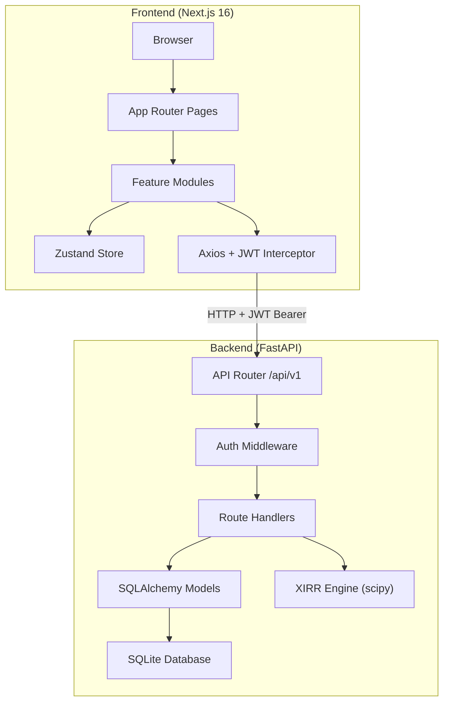
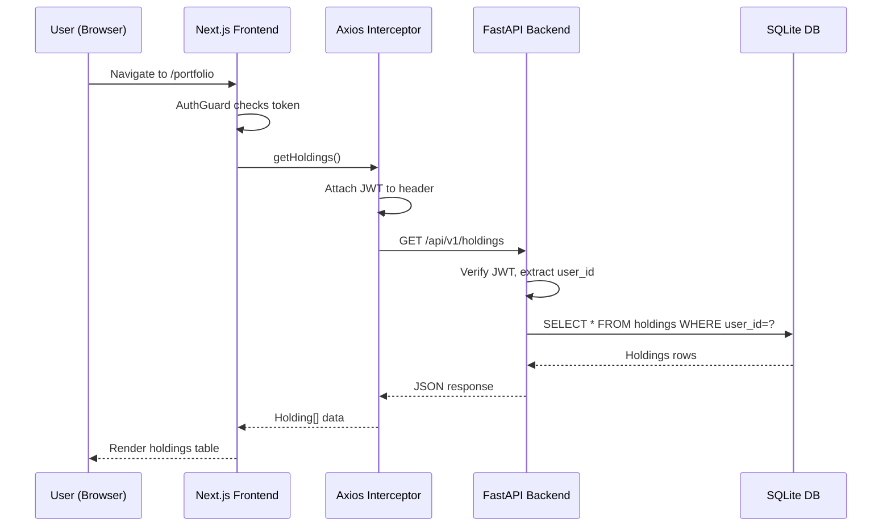
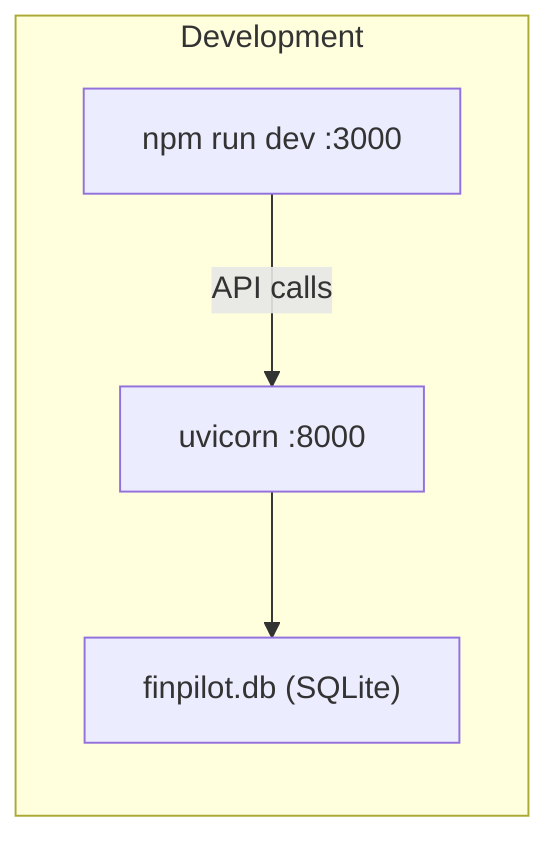

# FinPilot — System Architecture

## High-Level Overview

FinPilot is a full-stack portfolio management application with a clear separation between the Next.js frontend and FastAPI backend, connected via REST API over HTTP.

### How it works

1. **User opens browser** → Next.js serves the SPA
2. **Login** → Frontend sends credentials to `/api/v1/auth/login`, receives JWT
3. **JWT is stored** in `localStorage` and attached to every subsequent request via Axios interceptor
4. **Protected pages** (dashboard, portfolio, etc.) are wrapped in `AuthGuard` which redirects to `/login` if no token
5. **API calls** hit the FastAPI backend, which validates the JWT, queries SQLite, and returns JSON
6. **Demo mode** — if the backend is unreachable, all hooks fall back to hardcoded demo data

---

## Request Flow

---

## Deployment Architecture

For production, the frontend can be built as a static export (`next build`) and served via any CDN/static hosting. The backend can be deployed to any Python hosting (Railway, Render, EC2) with the SQLite file, or swapped to PostgreSQL by changing `DATABASE_URL`.
