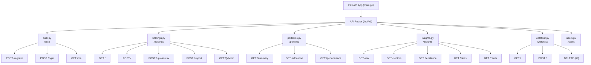
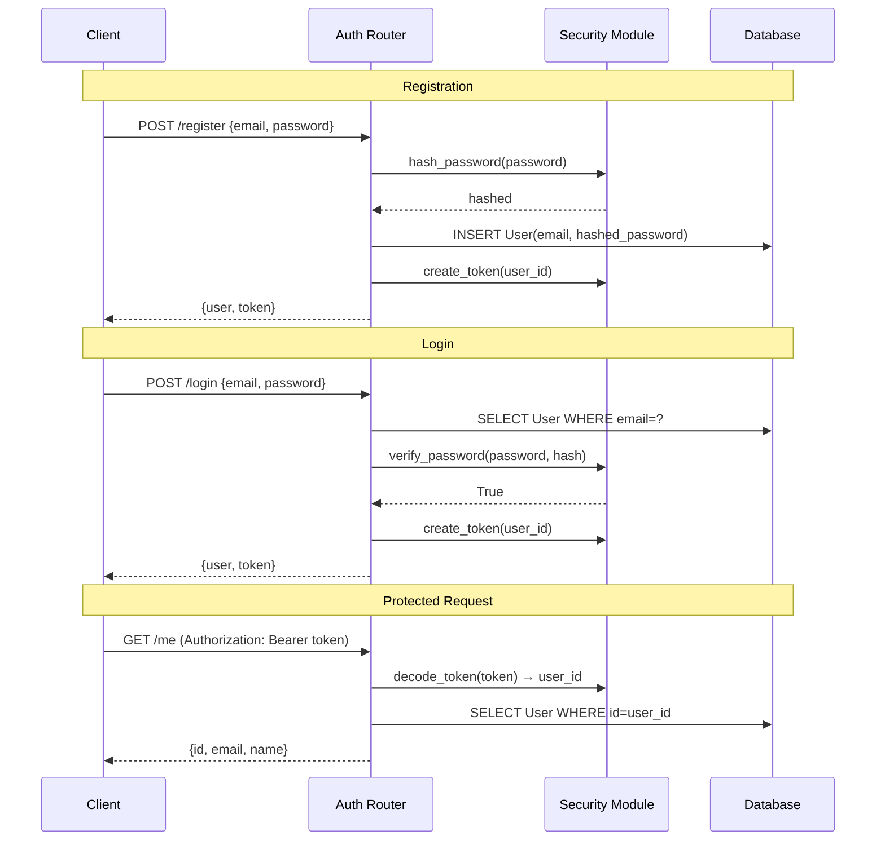
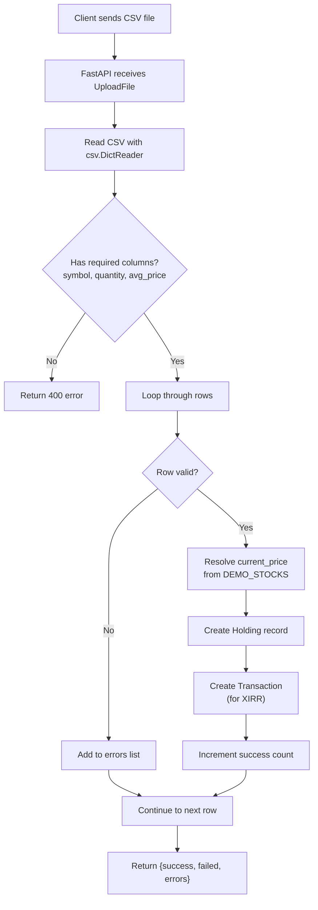

# Backend API Architecture

## Route Structure

The backend organizes routes under a single versioned prefix `/api/v1`, with each domain in its own router module.

## Authentication Flow

## Dependency Injection

FastAPI's dependency injection system provides:

- **`get_db`** — yields a SQLAlchemy session, auto-closes after request
- **`get_current_user`** — extracts JWT from `Authorization` header, decodes it, and loads the User from DB

All protected routes use `Depends(get_current_user)` to automatically authenticate.

## CSV Upload Pipeline

## XIRR Calculation

XIRR (Extended Internal Rate of Return) calculates annualized return from irregular cash flows:

1. Fetch all transactions for a holding
2. Map each to `(date, amount)` — buys are negative, sells are positive
3. Add current portfolio value as final positive cash flow (today's date)
4. Use `scipy.optimize.brentq` to find the rate `r` such that `Σ cashflow_i / (1+r)^(days_i/365) = 0`
5. Return `r * 100` as percentage
