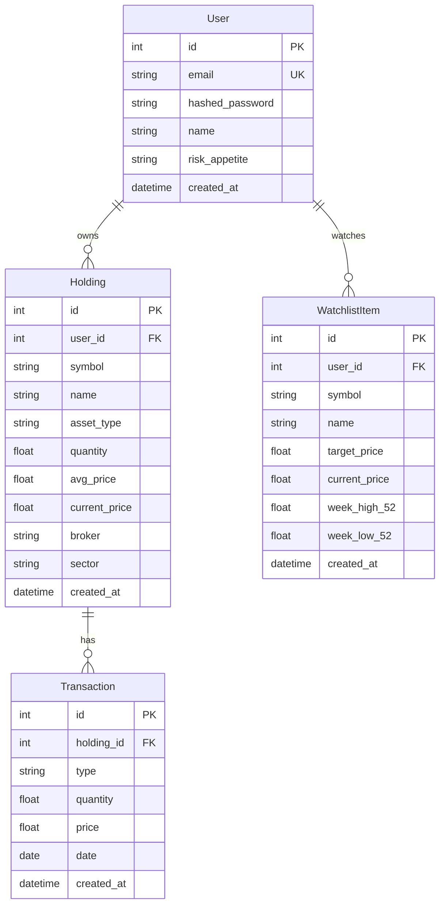
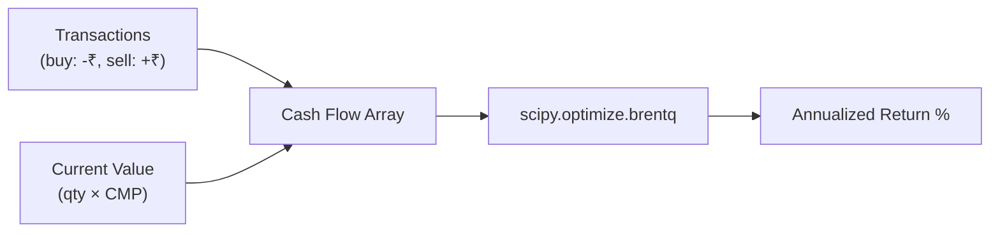

# Data Model

## Entity Relationship Diagram



## Model Details

### User

| Field | Type | Description |
|-------|------|-------------|
| `id` | Integer PK | Auto-increment |
| `email` | String (unique) | Login identifier |
| `hashed_password` | String | bcrypt hash |
| `name` | String (optional) | Display name |
| `risk_appetite` | String | `conservative`, `moderate`, or `aggressive` |
| `created_at` | DateTime | Registration timestamp |

### Holding

| Field | Type | Description |
|-------|------|-------------|
| `id` | Integer PK | Auto-increment |
| `user_id` | Integer FK → User | Owner |
| `symbol` | String | Ticker symbol (e.g., `RELIANCE`) |
| `name` | String | Company/fund name |
| `asset_type` | String | `stock` or `mutual_fund` |
| `quantity` | Float | Number of units held |
| `avg_price` | Float | Average purchase price |
| `current_price` | Float | Current market price (from demo data) |
| `broker` | String | `groww`, `upstox`, or `manual` |
| `sector` | String | Industry sector |
| `created_at` | DateTime | Record creation time |

### Transaction

Used for XIRR calculation. Each buy/sell event for a holding.

| Field | Type | Description |
|-------|------|-------------|
| `id` | Integer PK | Auto-increment |
| `holding_id` | Integer FK → Holding | Parent holding |
| `type` | String | `buy` or `sell` |
| `quantity` | Float | Units transacted |
| `price` | Float | Price per unit at transaction time |
| `date` | Date | Transaction date |

### WatchlistItem

| Field | Type | Description |
|-------|------|-------------|
| `id` | Integer PK | Auto-increment |
| `user_id` | Integer FK → User | Owner |
| `symbol` | String | Ticker symbol |
| `name` | String | Company name |
| `target_price` | Float | User's buy target |
| `current_price` | Float | Current market price |
| `week_high_52` | Float | 52-week high |
| `week_low_52` | Float | 52-week low |

## XIRR Data Flow



The XIRR formula solves for the rate `r` that makes the NPV of all cash flows equal to zero:

```
NPV = Σ CFᵢ / (1 + r)^(dᵢ/365) = 0
```

Where `CFᵢ` is each cash flow (negative for buys, positive for sells and current value), and `dᵢ` is the number of days from the first transaction.
