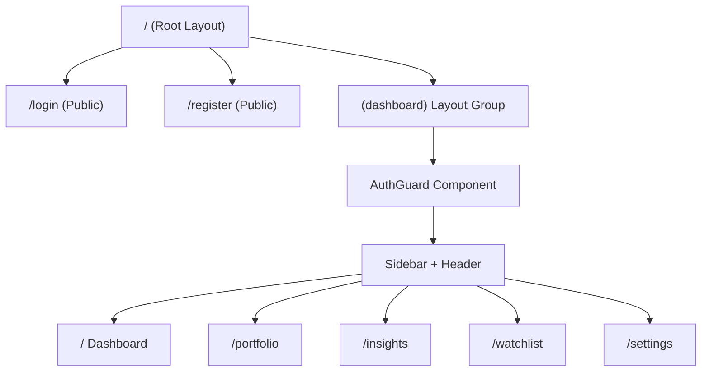
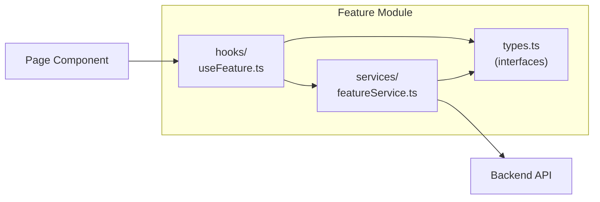
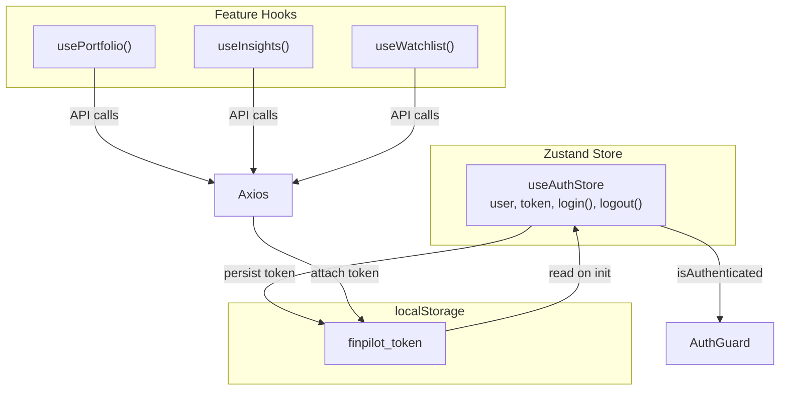
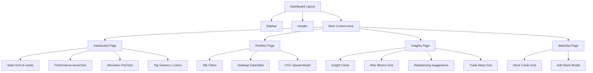

# Frontend Architecture

## Page Routing

The frontend uses Next.js App Router with route groups for layout separation.

The `(dashboard)` route group wraps all authenticated pages in a shared layout with Sidebar and Header. The `AuthGuard` component redirects to `/login` if no JWT token is found.

## Feature Module Pattern

Each feature follows the same structure for consistency and maintainability:

### Example: Portfolio Feature

| File | Purpose |
|------|---------|
| `features/portfolio/types.ts` | `Holding`, `PortfolioSummary`, `AllocationItem`, `CSVUploadResult` |
| `features/portfolio/services/portfolioService.ts` | API calls: `getHoldings()`, `getPortfolioSummary()`, `uploadCSV()` |
| `features/portfolio/hooks/usePortfolio.ts` | React hook with state, loading, demo fallback |

## State Management

- **Global state:** Only auth (user + token) is in Zustand
- **Feature state:** Each page's data lives in its own hook (`useState` + `useEffect`)
- **Demo fallback:** If API calls fail, hooks serve hardcoded demo data — the app works without a running backend

## Component Hierarchy

## Design System

The design uses CSS custom properties defined in `globals.css`:

| Token | Value | Usage |
|-------|-------|-------|
| `--bg-primary` | `#0a0e1a` | Page background |
| `--bg-card` | `rgba(17,24,39,0.7)` | Glass card background |
| `--accent` | `#6366f1` | Primary accent (indigo) |
| `--green` | `#10b981` | Positive values, gains |
| `--red` | `#ef4444` | Negative values, losses |
| `--border` | `rgba(255,255,255,0.08)` | Subtle glass borders |

Key CSS classes: `.card`, `.stat-card`, `.data-table`, `.btn`, `.badge`, `.tab-pills`, `.upload-zone`
